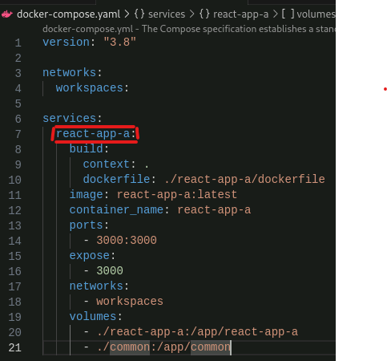

# Important Notes<br/>
!Read these before progressing!
1. The folder name of each app **must** match it's name in the `workspaces` section of the **root** level `package.json` <br/>
2. The name of each app in individual app `package.json` files **must** match it's folder name
3. The name of each app in `docker-compose.yaml` **must** match it's name in the `workspaces` section of the **root** level `package.json` <br/><br/>
This is not simply for readability, but a requirement to ensure correct functionality of NPM Workspaces when used in conjunction with docker

<br/>

# Running Apps
### With Docker
- In the root directory, run `docker-compose up --build <app-name>`
  - `<app-name>` as defined in the `docker-compose.yaml` file in `root` <br/>

  - For example: `docker-compose up --build react-app-a`
- Once completed, react-app-a should be running on <http://localhost:3000>

### Without Docker
- In the root directory, run: <br/>
1: run `npm i` at the root level <br/>
2: run `npm start --workspace=react-app-a` <br/>
2: alternative custom run command added: `npm run app <app-name>` <br/>
<br/>

# Creating a new app
1. `cd` into the `./apps` directory
2. Run `npm run create <app-name>`, replacing `<app-name>` with the name of your new app. <br/>
After completing, your new app will be ready to run using `docker-compose up --build <app-name>` or `npm run app <app-name>`
<br/>

# Manually Creating a New App (Obsolete)
### Create React App Setup (Obsolete)
At **root** level: <br/>
1: Run `npx create-react-app <app-name> --template="typescript"` <br/>
2: Run `npm init -w <app-name>` <br/>
2.1: Accept all default values, _except for_ `entry point`, this must be set to `index.js` <br/>
2.1.1: The reason for this is that after running `npm init -w ..`, npm may assume that `craco.config.js` is your entrypoint. <br/>
~~3: Update the `package.json` 'scripts' section, adding a command as follows: `"<app-name>": "npm start --workspace=<app-name>"`~~
<br/>| This step is no longer necessary as a custom command has been added to run apps from root: `npm run app <app-name>` 

Within the new app's directory `./<app-name>`: <br/>
1: Run `npm i -D @craco/craco` <br/>
2: Copy `craco.config.js.example` from the root folder to the app directory <br/>
3: Update the `package.json` 'scripts' section, replacing `react-scripts` with `craco` <br/>
3.1: Leave `react-scripts eject` as it is, do not change this to `craco eject` <br/>

You can now run the app with workspaces from the **root** level using `npm run app <app-name>`, but it will not work with docker yet.

To set up docker functionality for the app, you must create a new `dockerfile` and add a `service` to the `docker-compose.yaml`

> Remember to replace `<app-name>` with your new CRA's name

- Create a new `dockerfile` in the app's directory, using `react-app-a`'s as a template:
``` dockerfile
FROM node:latest

WORKDIR /app

COPY ./<app-name>/package.json ./<app-name>/package.json
COPY ./common/package.json ./common/package.json
COPY ./package.json ./
RUN npm install

COPY ./<app-name> ./<app-name>
COPY ./common ./common

CMD ["npm", "run", "app", "<app-name>"]
```

- Add a `service` to the `docker-compose.yaml`, using `react-app-a` as a template:
> Note that each new service should have it's own unique `ports`, this way if you are running all of your apps at once, they do not clash with eachother.
```yaml
version: "3.8"

networks:
  workspaces:

services:
  react-app-a:
    build:
      context: .
      dockerfile: ./react-app-a/dockerfile
    image: react-app-a:latest
    container_name: react-app-a
    ports:
      - 3000:3000
    expose:
      - 3000
    networks:
      - workspaces
    volumes: 
      - ./react-app-a:/app/react-app-a
      - ./common:/app/common
  <app-name>:
    build:
      context: .
      dockerfile: ./<app-name>/dockerfile
    image: app-name:latest
    container_name: app-name
    ports:
      - 3001:3001
    expose:
      - 3001
    networks:
      - workspaces
    volumes: 
      - ./<app-name>:/app/<app-name>
      - ./common:/app/common
```

### Api Setup (Obsolete)
